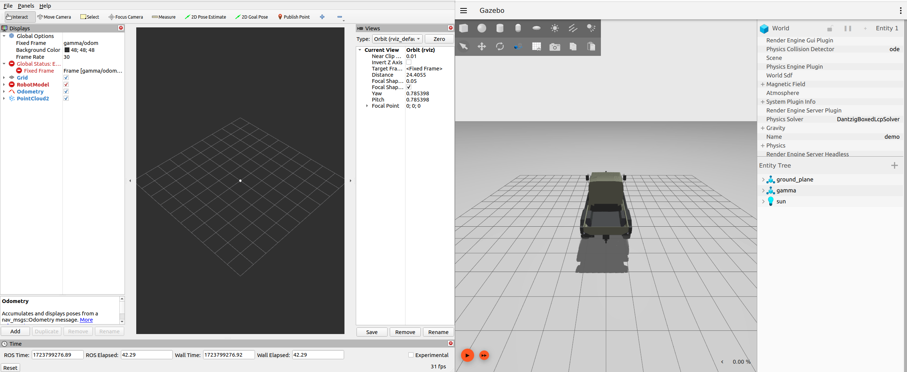

# Gamma Gazebo simulation

[](https://docs.ros.org/en/humble/)

## Description

## Installation

### Prerequisites

- ROS 2 Humble
- Ignition Gazebo Fortress

After Ignition Gazebo Fortress installation, make sure that the ```IGN_VERSION``` system variable is set to ```fortress```.

```
export IGN_VERSION=fortress
```

### Installation steps

1. Create a workspace and go to the ```src``` directory. Alternatively, an already existing workspace can be used as well.

```
mkdir -p ~/gammasim_ws/src
cd ~/gammasim_ws/src
```

2. Clone the repository and select the ```gamma``` branch.

```
git clone https://github.com/jkk-research/sim_wayp_plan_tools.git
cd sim_wayp_plan_tools
git checkout gamma
```

3. Install dependencies

```
cd ~/gammasim_ws
source /opt/ros/humble/setup.bash
sudo rosdep init
rosdep update
rosdep install --from-paths src --ignore-src -r -i -y --rosdistro humble

```

4. Source the workspace, or add sourcing it to ```bashrc```.

```
source ~/gammasim_ws/install/setup.bash
```

## Usage

### Launching the simulator

```
ros2 launch gamma_bringup gamma.launch.py
```

A setup should appear similar to the one presented below:



### Topics

1. Actuation

- topic name: /gamma/cmd_vel
- topic type: geometry_msgs/msg/Twist

- example:

```
ros2 topic pub /gamma/cmd_vel geometry_msgs/msg/Twist "{linear: {x: 1.0, y: 0.0, z: 0.0}, angular: {x: 0.0, y: 0.0, z: 0.2}}"
```

2. Vehicle proprioceptive infomration

- Velocity
    - topic name: /gamma/velocity
    - topic type: std_msgs/msg/Float64
- Steering angle
    - topic name: /gamma/position (note: Not the most intuitive name, it originates from the original Gazebo joint. It is to be changed.)
    - topic type: std_msgs/msg/Float64
- Odometry
    - topic name: /gamma/odometry
    - topic type: nav_msgs/msg/Odometry

## Repository strucutre

- gamma_application 

